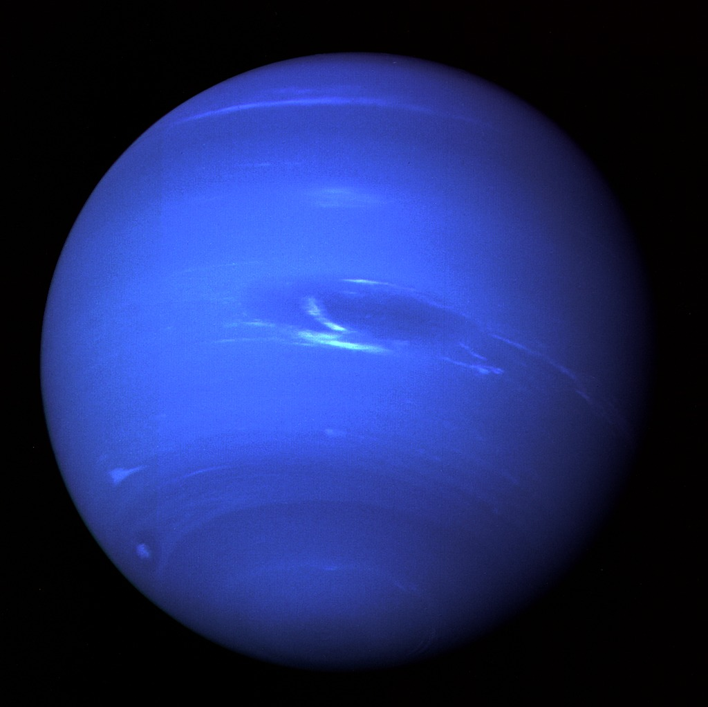
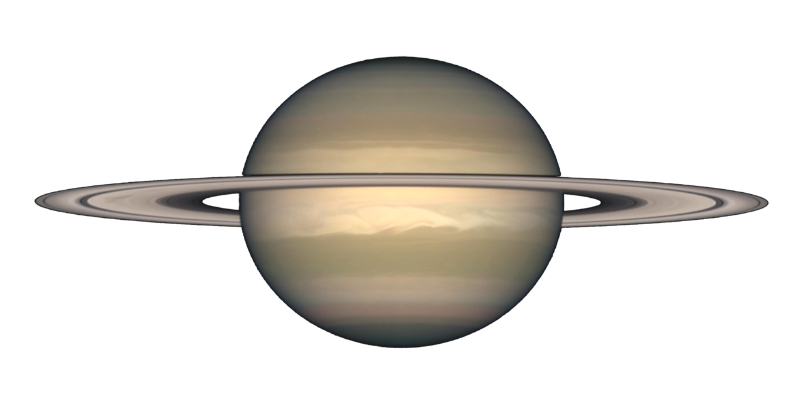

<!DOCTYPE html>
<html lang="en">
<head>
  <meta charset="utf-8">
  <title>Planet Information</title>
  <link rel="stylesheet" href="css/style.css">
</head>
<body>
  

    <h1>Facts about these top four planets</h1>
	

  <table id="planets">
    <tr>
      <th></th>
      <th>Venus</th>
      <th>Neptune</th>
      <th>Saturn</th>
      <th>Mercury</th>
    </tr>
    <tr>
      <td>Images of these four planets</td>
      <td></td>
      <td></td>
      <td></td>
      <td></td>
    </tr>
    <tr>
      <td>Fact #1</td>
      <td>Venus is called Earth's twin due to it being a little bit smaller than Earth.</td>
      <td>Neptune just like Uranus is called an ice giant.</td>
      <td>Saturn's rings are mostly made of ice, rocks, and dust.</td>
      <td>Mercury is the first and smallest planet in the solar system </td>
    </tr>
    <tr>
      <td>Fact #2</td>
      <td>Venus is the slowest rotating planet in the solar system. 1 day lasts about 1 year.</td>
      <td>Neptune has the fastest and strongest winds.</td>
      <td>Saturn is the 2nd largest planet in the solar system.</td>
      <td>Mercury has no atmosphere like Venus does. That's why it's not the hottest.</td>
    </tr>
    <tr>
      <td>Fact #3</td>
      <td>Venus' atmosphere is 96 % carbon dioxide 3% nitrogen and 1% gases.</td>
      <td>Neptune has over 14 moons, it's most popular being Triton.</td>
      <td>Saturn like Jupiter is called a Gas Giant.</td>
      <td>Mercury has the shortest years with only 88 Earth days.</td>
    </tr>
    <tr>
      <td>Fact #4</td>
      <td>Venus is the 2nd and hottest planet in the solar system.</td>
      <td>Neptune is roughly -225 degrees celceius.</td>
      <td>Saturn has over 146 moons.</td>
      <td>Mercury has no moons.</td>
    </tr>
    <tr>
      <td>Fact #5</td>
      <td>Venus is the 2nd and hottest planet in the solar system.</td>
      <td>Neptune is made of methane hydrogen and helium gas.</td>
      <td>Saturn's surface temperature is -180 degrees celcius.</td>
      <td>Mercury is mostly a mix of metals and silca.</td>
    </tr>
    <tr>
      <td>Fact #6</td>
      <td>The rain on Venus is made mostly of sulfuric acid.</td>
      <td>Neptune has rings much like Saturn.</td>
      <td>Saturn's rotation can last for 10.7 hours compared to Earth.</td>
      <td>Mercury has a very thin exoshphere.</td>
    </tr>
    <tr>
      <td>Fact #7</td>
      <td>Venus has around 1,600 volcanoes and some are still active according to NASA.</td>
      <td>Scientists believed that Neptune's moon trition was part of the creation of the solar system but was pulled in by Neptune's gravity.</td>
      <td>Saturn has a hexagon shaped storm on the top of the planet.</td>
      <td>Theories has been claimed that Mercury can have cold water inside deep craters.</td>
    </tr>
  </table>
</body>
